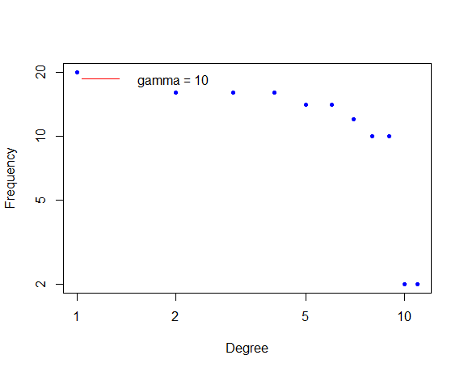

<!-- Improved compatibility of back to top link: See: https://github.com/othneildrew/Best-README-Template/pull/73 -->

<!-- PROJECT LOGO -->
 

<h3 align="center">Network-Degree-Distribution-and-Power-law-Modeling-in-Complex-Systems 🌐</h3>

  

    Department of Bioinformatics, IBB, University of Tehran
     
  

  

<!-- ABOUT THE PROJECT -->
## ROADMAP 🗺️

This code is designed to analyze the structure of a complex network by examining its degree distribution and fitting a power-law distribution to the data. It starts by loading necessary R libraries, reading network data from a CSV file, and constructing a graph. Subsequently, it calculates the degree distribution of nodes in the network and sorts it in descending order. The code then fits a power-law distribution to this degree distribution and extracts the estimated power-law exponent (gamma). The results, including the degree distribution and estimated exponent, are saved in a CSV file. Additionally, a log-log plot is generated to visualize the degree distribution and the power-law fit, providing insights into the scale-free properties of the network, which are often observed in various real-world systems.

(<a href="#readme-top">back to top</a>)

## Languages Used 💻

 R Packages 

(<a href="#readme-top">back to top</a>)

<!-- GETTING STARTED -->
## Getting Started 🚀

### Installation

igraph, poweRlaw

(<a href="#readme-top">back to top</a>)

(<a href="#readme-top">back to top</a>)

<!-- CONTACT -->
## Contact 📧

Fereshteh Noroozi - [@LinkedIn](https://ir.linkedin.com/in/fereshteh-noroozi-a90886118?original_referer=https%3A%2F%2Fwww.google.com%2F) 

(<a href="#readme-top">back to top</a>)

<!-- ACKNOWLEDGMENTS -->
## Acknowledgments 🙌

Department of Bioinformatics, IBB, University of Tehran

(<a href="#readme-top">back to top</a>)

<!-- MARKDOWN LINKS & IMAGES -->
<!-- https://www.markdownguide.org/basic-syntax/#reference-style-links -->
[contributors-shield]: https://img.shields.io/github/contributors/github_username/repo_name.svg?style=for-the-badge
[contributors-url]: https://github.com/github_username/repo_name/graphs/contributors
[forks-shield]: https://img.shields.io/github/forks/github_username/repo_name.svg?style=for-the-badge
[forks-url]: https://github.com/github_username/repo_name/network/members
[stars-shield]: https://img.shields.io/github/stars/github_username/repo_name.svg?style=for-the-badge
[stars-url]: https://github.com/github_username/repo_name/stargazers
[issues-shield]: https://img.shields.io/github/issues/github_username/repo_name.svg?style=for-the-badge
[issues-url]: https://github.com/github_username/repo_name/issues
[license-shield]: https://img.shields.io/github/license/github_username/repo_name.svg?style=for-the-badge
[license-url]: https://github.com/github_username/repo_name/blob/master/LICENSE.txt
[linkedin-shield]: h
